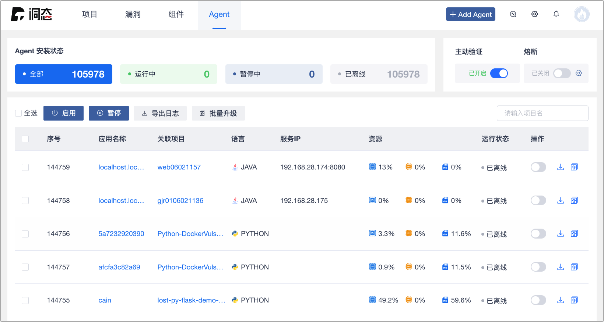
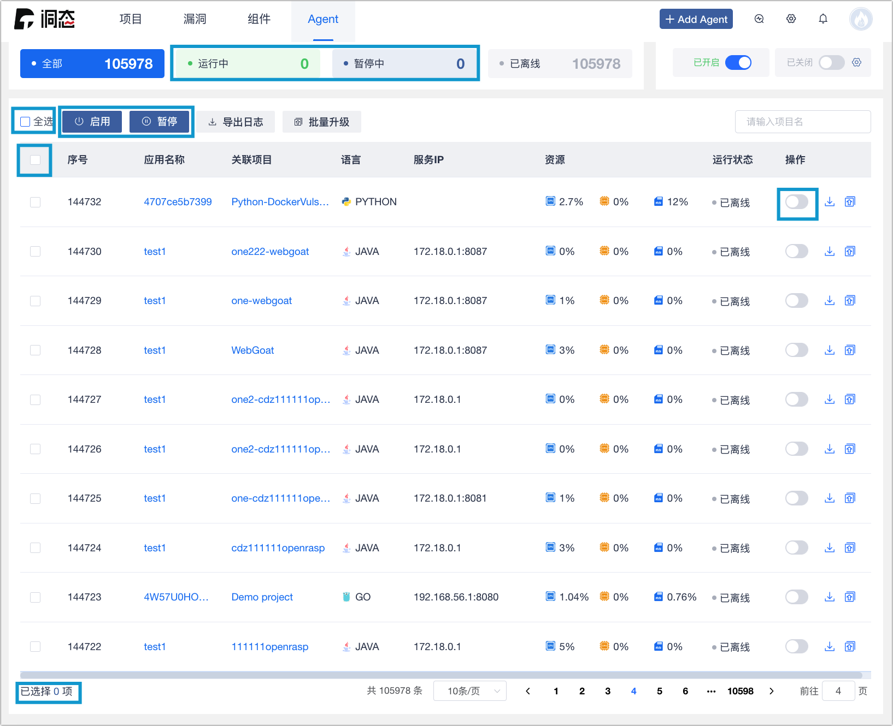
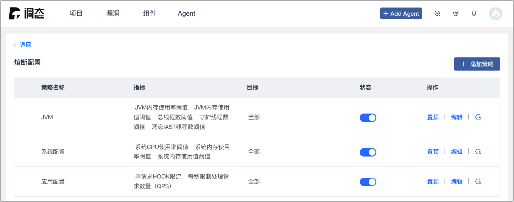

# Agent 管理

Agent 管理主要用于用户的 Agent 管理，在上方菜单栏的左边第四个。功能是展示总体 Agent 的仪表板页面。此页面展示的信息有：Agent 安装状态及展示列表，Agent 操作，Agent 主动验证及熔断配置。

## 展示 Agent

展示用户在洞态上安装的所有 Agent 信息。

### Agent 安装状态

可依据 Agent 的安装状态展示 Agent 列表。

* 全部：展示已安装的所有的洞态 Agent 数量。

* 运行中：展示正在服务器运行中的洞态 Agent 数量。

* 暂停中：展示服务器暂停中的洞态 Agent 数量。

* 已离线：展示已离线服务器的洞态 Agent 数量，超过两分钟没回传心跳的洞态 Agent 会判定成已离线，需重启服务来重新运行洞态 Agent。

:::tip

* 暂停中的洞态 Agent 只会上传心跳数据。

* 离线中的洞态 Agent 完全不会上传任何的数据。

:::

### Agent 展示列表

* 序号：Agent 的展示序号。

* 应用名称：应用服务的名称。

* 关联项目：关联项目的名称。

* 语言：安装的 Agent 语言

* 服务 IP：应用服务的地址，`ip:port`。

* 资源：展示目前服务器资源的状态，CPU，Memory 及 硬碟使用率。

* 运行状态：Agent 的运行状态，`运行中`、`暂停中`、`已离线`。

* 操作：启用或暂停 Agent 以及下载 Agent 的日志。

### Agent 详情

* 从 Agent 列表中点选 `应用名称` 查询 Agent 详情。

## 管理 Agent

管理 Agent 中包含：启停 Agent，升级 Agent 及 查询 Agent 日志的功能。

### 启用 / 暂停 Agent

在 Agent 列表中的操作点选启停按钮针可针对个别 Agent 去启停或透过选取 Agent 来达到批量启用 / 暂停。

* 只可对运行中或暂停中的 Agent 进行启停，离线中的 Agent 无法使用此功能。

* 批量选择可 `全选所有` 或 `当页列表`的 Agent，可从页面下方已选择栏位确认所选的 Agent 数量。

### 升级 Agent

在 Agent 列表中的操作点选升级按钮针可针对个别 Agent 去升级或透过选取 Agent 来达到批量升级。

* 只可对运行中的 Agent 进行升级。

### 查询 Agent 日志

在 Agent 列表中的操作点选导出日志按钮针可针对个别 Agent 去导出日志或透过选取 Agent 来达到批量导出日志。

* 只可对运行中的 Agent 进行导出 Agent 的运行日志。

## 主动验证

主动验证启用按钮在 Agent 仪表板页面的右上方。主动验证时，Engine 自动识别攻击参数位置，并构造 payload。仔从 Agent 内部重放 HTTP/HTTPS 流量，进行验证。

:::tip

* 关闭不会造成漏洞检测结果的变化，可自行关闭。

* 主动验证目前只支持：Apache Shiro 和 JSON Web Token (JWT)。

:::

## 熔断降级

熔断降级配的启用按钮在 Agent 仪表板页面的右上方。配置熔断可以优化服务性能损耗，点选 ⚙️ 进行熔断策略调整。

### 预设熔断降级配置

系统会默认系统配置、JVM 以及性能指标三个预设的熔断策略。也可以自定义去新增熔断策略。

### 自定义熔断降级配置

自定义熔断降级的页面，可设定的项目有`策略名称`、`策略目标`、`处理方式`、`策略的指标类型`以及`指标粒度`。

* 名称：策略名称。

* 目标：策略的对象目标，可按`系统账户`、`项目名`、`协议`、`Agent`、`Agent IP`、`Agent 启动路径`、`端口`、`语言`去设置添加条件。

* 处理：达到指标条件时，设定目标的洞态 Agent 会自动暂停，当指标条件恢复正常时对设定目标的洞态 Agent 可采取以下两种处理方式。

    * 完全卸载：不会自动启动洞态 Agent，需至 Agent 管理页面手动启用。

    * 恢复启用：会自动启动洞态 Agent。

* 指标类型：可按`性能指标`、`JVM 指标`、`应用指标`去设置熔断降级指标条件。

    * 系统 CPU 使用率阈值：系统 CPU 占用率（%）。

    * 系统内存使用率阈值：系统内存占用率（%）。
    
    * 系统内存使用值阈值：系统内存占用值（byte）。
    
    * JVM 内存使用率阈值：JVM 内存占用率（%）。
    
    * JVM 内存使用值阈值：JVM 内存占用值（byte）。
    
    * 总线程数阈值：当前应用的线程总数量。
    
    * 守护线程数阈值：当前应用守护线程的数量。
    
    * 洞态 IAST 线程数量阈值：限制洞态 Agent 的线程总数数量。
    
    * 单请求 Hook 限流：限制洞态 Agent 单个请求内每秒的 hook 数量，当 Hook 数超过设定值时，本次请求洞态 Agent 会局部熔断。
    
    * 每秒限制处理请求数量（QPS）：服务器每秒处理请求的数量超过设定值时，Agent 会全局熔断的数量。
    
    * 指标粒度：当指标条件超过设置的指标粒度（秒）时会开始熔断降级。