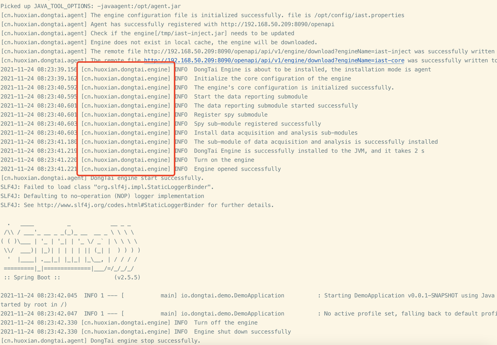

# Docker 集成 Dongtai Java Agent

## 思路

与Kubernetes的思路类似。

1. 获取对应版本的Agent: 从 `Dongtai Backend` 管理页面下载;
2. 将Agent拷贝到业务服务容器中:
3. 启动业务服务时候将 `Agent` 加入到启动参数中;

所以, 让业务 Docker 容器获取Agent的常见方式:

1. 打包专用的业务镜像的时候,将Agent一同打包进去;
2. 通过 volume  参数将 Agent 挂载到容器目录，本文介绍这种方式；

## 准备

- 一个可以运行 Docker 的节点；
- 一个目标业务服务的镜像: dongtai/dongtai-java-agent-demo:0.0.1；
- 假设我们通过上述某一种方式部署了Dongtai Backend服务;

## 获取 Agent

和上述 Kubernetes 部分的获取方式相同，直接去页面获取下载地址。
假设将 agent.jar 下载到当前节点的 /tmp/agent.jar 。

### 安装

执行下述 docker run 命令来运行

```shell
docker run -d \
--name dongtai-java-agent-docker-demo  \
-p 8080:8080 \
-v ~/Downloads/agent.jar:/opt/agent.jar \
-e JAVA_TOOL_OPTIONS='-javaagent:/opt/agent.jar' \
dongtai/dongtai-java-agent-demo:0.0.1
```

说明：

- 容器名称：dongtai-java-agent-docker-demo；
- 映射端口：宿主机8080 到 容器的 8080；
- 将宿主机下载的 agent.jar 映射到容器的 /opt/agent.jar目录；
- 指定Java运行的Opts参数 JAVA_TOOL_OPTIONS；

等待容器内服务启动完成，查看日志，内容如下：



日志显示 Dongtai Agent 已经加载成功。
